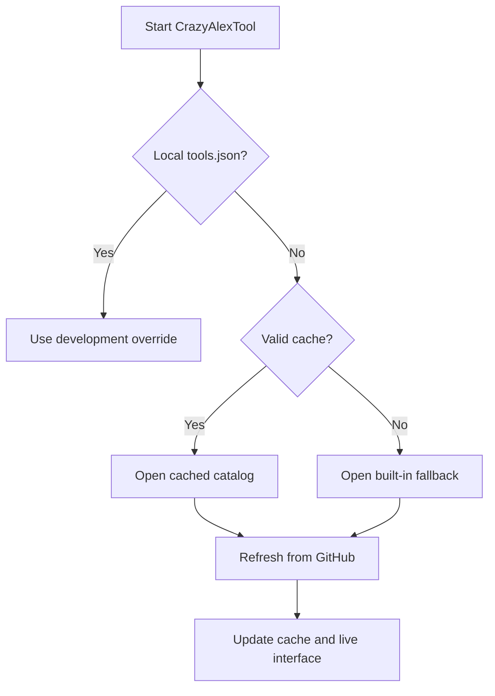

<div align="center">

# ⚡ CrazyAlexTool

### A modern PowerShell toolbox for Windows and macOS

<p>
  
  
  
</p>

<p>
  
  
  
</p>

One launcher for Office utilities, maintenance scripts, downloads, diagnostics and system tools—with a native WPF interface on Windows and a local browser interface on macOS.

[Quick start](#-quick-start) · [Features](#-highlights) · [Tool catalog](#-tool-catalog) · [Troubleshooting](#-troubleshooting)

<sub>Built and maintained by <a href="https://github.com/CrazyAlex15">CrazyAlex15</a></sub>

</div>

---

> [!IMPORTANT]
> CrazyAlexTool can download and execute external scripts, installers and packages, sometimes with administrator privileges. Review the sources and use only software for which you have the required licence or organisational entitlement.

## 🚀 Quick start

### Windows

Open **Windows PowerShell** and run:

```powershell
irm "https://crazyalex15.github.io/win?x=$(Get-Random)" | iex
```

The tool automatically requests administrator access and relaunches in **Windows PowerShell 5.1** when required for full WPF compatibility.

<details>
<summary><strong>🔍 Review the script before running</strong></summary>

```powershell
$path = Join-Path $env:TEMP "CrazyAlexTool.ps1"
$uri = "https://raw.githubusercontent.com/CrazyAlex15/CrazyAlexTool/main/CrazyAlexTool.ps1?x=$(Get-Random)"

Invoke-WebRequest -UseBasicParsing -Uri $uri -OutFile $path
notepad.exe $path
```

After reviewing the file:

```powershell
powershell.exe -NoProfile -ExecutionPolicy Bypass -File $path
```

</details>

### macOS

CrazyAlexTool requires **PowerShell 7 or newer** on macOS.

```bash
pwsh
```

Then run this from the PowerShell prompt:

```powershell
irm "https://crazyalex15.github.io/win?x=$(Get-Random)" | iex
```

The tool starts a local-only server on a random `127.0.0.1` port and opens its interface in your default browser. Keep the terminal open until you finish.

---

## ✨ Highlights

| | Capability | What it does |
|---|---|---|
| 🧩 | **Dynamic catalog** | Loads categories and tools from [`tools.json`](tools.json). |
| ⚡ | **Fast startup** | Opens from a local cache or built-in fallback while GitHub refreshes in the background. |
| 🔎 | **Instant search** | Filters the visible tools by name and search tags. |
| 📊 | **Live progress** | Shows per-tool state, progress, speed and cancellation controls. |
| 🖥️ | **Cross-platform UI** | Uses WPF on Windows and a local browser interface on macOS. |
| 🎨 | **Personal settings** | Supports accent colours, confirmations, auto-refresh, notifications and logging. |
| 🧹 | **Automatic cleanup** | Removes tool-managed temporary and session download files. |
| 🔄 | **Cloud updates** | Refreshes the catalog independently and can restart from the latest launcher. |

### Built-in Windows utilities

- System-information dashboard with optional automatic refresh
- SFC system-file scan
- Network reset
- Saved Wi-Fi profile and password export
- Windows product-key lookup
- Configurable download directory
- Tool activity log and desktop notifications

---

## 🧰 Tool catalog

CrazyAlexTool `1.8.3` currently uses catalog `v9` with **12 tools** across three dynamic categories.

### 🪟 OFFICE WINDOWS

| Tool | Type | Purpose |
|---|:---:|---|
| **Install Office** | Built-in | Downloads the Microsoft Office Deployment Tool and starts Office setup. |
| **365ProPlusRetail64** | Download | Microsoft 365 Apps for enterprise, 64-bit. |
| **ProPlus2024Retail64** | Download | Office Professional Plus 2024 Retail, 64-bit. |
| **Office Scrubber** | Built-in | Office cleanup, removal and licence-state reset options. |
| **Win Office Tools** | Script | Downloads and starts the configured Windows Office tools script. |

### 🍎 OFFICE macOS

| Tool | Type | Purpose |
|---|:---:|---|
| **Office macOS** | Package | Downloads the Microsoft Office installer for macOS. |
| **Office-Reset tool 2.0 Beta1** | Package | Downloads the configured Office Reset package. |
| **Activator (Serializer)** | Package | Downloads the configured Office LTSC 2024 volume-licence serializer. A valid organisational entitlement is required. |

### 📜 SCRIPTS

| Tool | Type | Purpose |
|---|:---:|---|
| **Activate WinRAR** | Built-in | Applies the configured registration file to an installed WinRAR copy. |
| **GenP Activator** | Built-in | Downloads the configured archive and presents its available executable versions. |
| **GenP v4.2.1** | Download | Downloads and starts the configured v4.2.1 executable. |
| **System Update** | Script | Starts the configured Windows update script. |

> [!NOTE]
> Windows-only tools remain visible but disabled in macOS mode. When a macOS `.pkg` is selected from Windows, it is downloaded to the configured folder instead of being executed.

---

## 🧠 How the catalog works



The production catalog is [`tools.json`](tools.json). Loading follows this order:

1. A valid `tools.json` beside `CrazyAlexTool.ps1` becomes the local development override.
2. Otherwise, the last valid cached catalog loads immediately.
3. If no valid cache exists, the built-in fallback catalog is displayed.
4. The latest GitHub catalog refreshes in the background after the interface opens.

### Local catalog testing

Place both files in the same folder:

```text
CrazyAlexTool.ps1
tools.json
```

During that run, the local catalog is used directly and is not overwritten by the background refresh.

---

## 💾 Application data

### Windows

| Data | Default location |
|---|---|
| Settings | `%APPDATA%\CrazyAlexTool\settings.json` |
| Log | `%APPDATA%\CrazyAlexTool\log.txt` |
| Catalog cache | `%APPDATA%\CrazyAlexTool\tools.json` |
| Temporary files | `%TEMP%\CrazyAlexTool` |
| Downloads | `%USERPROFILE%\Downloads\CrazyAlexTool` |

### macOS

| Data | Default location |
|---|---|
| Catalog cache | `~/Library/Application Support/CrazyAlexTool/tools.json` |
| Package downloads | `~/Downloads/CrazyAlexTool` |

The macOS download folder is tool-managed. Leftovers from interrupted downloads are cleared when a new session starts, and completed packages open with the macOS Installer.

---

## 🛠️ Troubleshooting

<details>
<summary><strong>The Windows interface does not open</strong></summary>

- Confirm that the computer runs Windows 10 or Windows 11.
- Confirm that Windows PowerShell 5.1 exists in its standard system location.
- If you launched from PowerShell 7, allow the automatic PowerShell 5.1 relaunch.
- Accept the administrator prompt.

</details>

<details>
<summary><strong>The macOS interface does not open</strong></summary>

- Run `pwsh --version` and confirm that it reports PowerShell 7 or newer.
- Keep the terminal open while CrazyAlexTool is running.
- Look in the terminal for the generated `http://127.0.0.1:<port>/` address and open it manually if the browser does not launch.

</details>

<details>
<summary><strong>The catalog looks outdated</strong></summary>

- Restart CrazyAlexTool and allow the background refresh to complete.
- Check whether a local `tools.json` beside the script is overriding GitHub.
- Remove the cached `tools.json` from the application-data folder and restart if the cache is invalid.

</details>

<details>
<summary><strong>A download or tool fails</strong></summary>

- Check the internet connection.
- Confirm that GitHub and the configured source are reachable.
- Review `%APPDATA%\CrazyAlexTool\log.txt` when Windows logging is enabled.
- Retry only after confirming that the source and downloaded file are trusted.

</details>

---

## 📁 Repository map

<details>
<summary><strong>View repository files</strong></summary>

| File | Purpose |
|---|---|
| [`CrazyAlexTool.ps1`](CrazyAlexTool.ps1) | Main cross-platform application and Windows WPF interface |
| [`tools.json`](tools.json) | Dynamic tool catalog and categories |
| `OfficeScrubber.zip` | Payload used by the built-in Office Scrubber action |
| `WinOfficeTools.bat` | Windows Office tools launcher |
| `UpdateSystemWithPSCheck.bat` | Windows system-update launcher |
| `Microsoft_Office_Reset_2.0.0.pkg` | Office Reset package for macOS |
| `Microsoft_Office_LTSC_2024_VL_Serializer.pkg` | Office LTSC 2024 serializer package for macOS |
| `GenP-main.zip` | Archive used by the built-in GenP action |
| `rarreg.key` | Registration file used by the WinRAR action |

</details>

---

## 🔄 Updating

Open **Settings → Update Tool** to close the current session and restart from the latest launcher.

The application and catalog update independently:

- Changes to `CrazyAlexTool.ps1` update the interface and built-in functionality.
- Changes to `tools.json` can add, remove or reorganise catalog entries without releasing a new application version.

---

## 🛡️ Security and responsibility

> [!CAUTION]
> CrazyAlexTool may execute downloaded content with elevated privileges. Inspect external sources, validate files where possible, keep backups of important data and never disable security protections simply to force a download or script to run.

Third-party names, packages and trademarks belong to their respective owners. The repository owner is not responsible for damage, data loss, licensing violations or other consequences caused by third-party tools or modified catalog entries.

<div align="center">

Made with PowerShell ⚡ by <a href="https://github.com/CrazyAlex15">CrazyAlex15</a>

<br>

<a href="#-crazyalextool">Back to top ↑</a>

</div>
